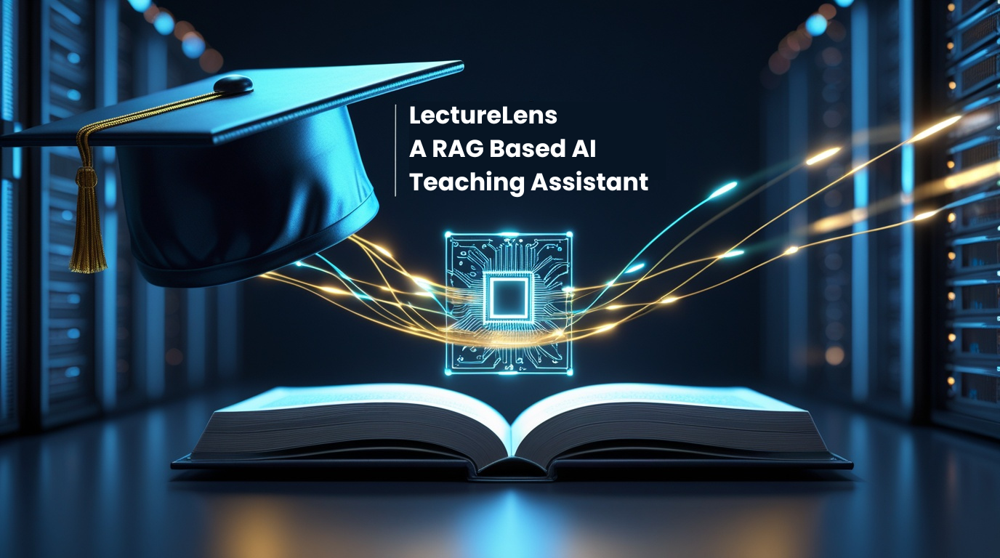
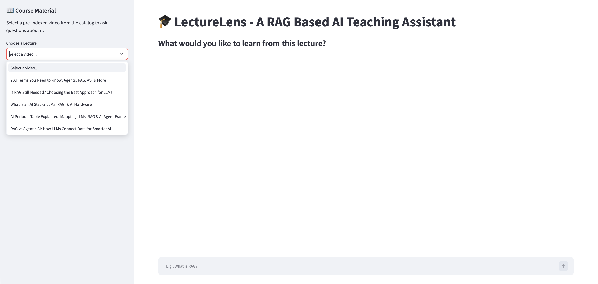
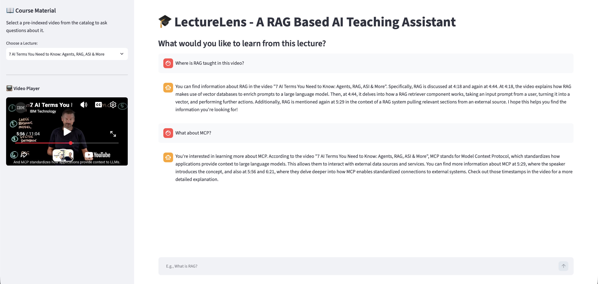

<div align="center">
  
  
  <h1>🎓 LectureLens: A RAG Based AI Teaching Assistant</h1>
  <p><b>A cloud-native, interactive AI tutor with a decoupled data pipeline, metadata filtering, and an auto-seeking video player.</b></p>

  [](https://lecturelens-a-rag-based-ai-teaching-assistant.streamlit.app/)
  <br><br>
  
  <p>
    
    
    
    
    
    
  </p>
</div>

---

## 🌟 Overview

>**LectureLens** is an advanced educational tool designed to eliminate the friction of "video scrubbing." It transforms any standard educational YouTube video into an interactive, fully searchable knowledge base.

Built with an enterprise-grade **Retrieval-Augmented Generation (RAG)** architecture, the application completely decouples data ingestion from user inference. By utilizing pre-indexed vectors in a **Pinecone Cloud database** and strict **Metadata Filtering**, users can select a lecture from the course catalog, ask complex questions, and get near-instantaneous answers. The UI features a dynamic, auto-seeking embedded YouTube player that instantly jumps to the exact timestamp the AI cites.

---

## 🚀 Core Features

### 1. Decoupled Data Pipeline (Batch Ingestion)
- **Backend Processing:** A dedicated local script (`build_database.py`) handles downloading transcripts, semantic chunking, and embedding.
- **Zero Cloud-Scraping Blocks:** By pre-indexing data into Pinecone, the deployed Streamlit app never scrapes live URLs, ensuring 100% uptime and bypassing aggressive anti-bot protections.

### 2. Multi-Tenant Metadata Filtering
- **Data Isolation:** When a user selects a lecture from the sidebar catalog, Pinecone uses MongoDB-style `$eq` operators to strictly filter the vector search to *only* that specific video ID. 
- **Lightning Fast Inference:** Searching only relevant metadata dramatically reduces search space and latency.

### 3. Conversational AI & Dynamic UI
- **Auto-Seeking Player:** The Streamlit frontend extracts timestamps from the retrieved vector metadata and automatically seeks the embedded YouTube player to the exact moment the topic is taught.
- **Groq & Llama 3.3:** Synthesizes human-like, conversational answers using Meta's 70B parameter model running on Groq's LPU architecture for sub-second text generation.

---

## 🧠 Evolution of the Architecture
> The initial iteration of this project attempted "Real-Time Ingestion"—allowing users to paste a URL and wait while the server scraped, embedded, and indexed the video live. However, cloud deployments (like Streamlit Cloud) are frequently IP-blocked by YouTube's anti-bot mechanisms. 
> 
> **The Solution:** The system was refactored to mirror **Enterprise Batch Processing**. The data pipeline is now decoupled. Videos are batch-processed locally into a Pinecone Vector Database. The cloud frontend acts strictly as a lightweight retrieval and inference engine. This eliminated scraping blocks entirely and decreased user-facing latency by over 90%.

---

## 📸 App Screenshots

### 1. The Dynamic Course Interface
> Selecting a pre-indexed lecture populates the embedded video player and sets the database filters.


### 2. Interactive AI Chat
> Asking a question triggers a Pinecone metadata search, dynamically seeks the video to the correct timestamp, and generates a contextual answer. 


---

## 📁 Repository Structure

```text
📁 LectureLens/
    ├── 📁 .devcontainer/
    │   └── 🔢 devcontainer.json
    ├── 📄 .gitignore
    ├── 📄 LICENSE
    ├── 📁 Old_Codes/
    │   ├── 📄 app_old.py
    │   ├── 📄 merge_chunks.py
    │   ├── 📄 mp3_to_json.py
    │   ├── 📄 preprocess_json.py
    │   ├── 📄 process_incoming.py
    │   ├── 📄 process_incoming_old.py
    │   ├── 📄 stt.py
    │   └── 📄 video_to_mp3.py
    ├── 📄 README.md
    ├── 📄 app.py
    ├── 📁 assets/
    │   ├── 🖼️ Chatbot_Interface.png
    │   ├── 🖼️ LectureLens_Banner.png
    │   └── 🖼️ Video_Processing_Sidebar.png
    ├── 📄 build_database.py
    └── 📄 requirements.txt
```

---

## 🛠️ Installation & Setup

Follow these steps to run the application on your local machine.

### 1. Clone the Repository
```bash
git clone [https://github.com/Dheeraj1771/LectureLens.git](https://github.com/Dheeraj1771/LectureLens.git)
cd LectureLens
```

### 2. Create a Virtual Environment (Recommended)
```bash
conda create -n lecturelens python=3.10
conda activate lecturelens
```

### 3. Install Dependencies
```bash
pip install -r requirements.txt
```

### 4. Configure Cloud API Keys
Create a `.env` file in the root directory and add your secret keys for the three cloud services:
```env
HF_TOKEN="your_hugging_face_token_here"
GROQ_API_KEY="your_groq_api_key_here"
PINECONE_API_KEY="your_pinecone_api_key_here"
```

### 5. (Optional) Ingest New Videos
To add new videos to the catalog, update the `course_catalog` dictionary in `build_database.py` and run:
```bash
python build_database.py
```

### 6. Run the Application
```bash
streamlit run app.py
```
The application will automatically open in your default web browser at `http://localhost:8501`.

---

## 🤝 Contributing

Contributions, issues, and feature requests are welcome! Feel free to check the issues page if you want to contribute.

1. Fork the Project
2. Create your Feature Branch (`git checkout -b feature/AmazingFeature`)
3. Commit your Changes (`git commit -m 'Add some AmazingFeature'`)
4. Push to the Branch (`git push origin feature/AmazingFeature`)
5. Open a Pull Request

---

## 📝 License

Distributed under the MIT License. See `LICENSE` for more information.

---
<p align="center">Developed with ❤️ by K Dheeraj</p>